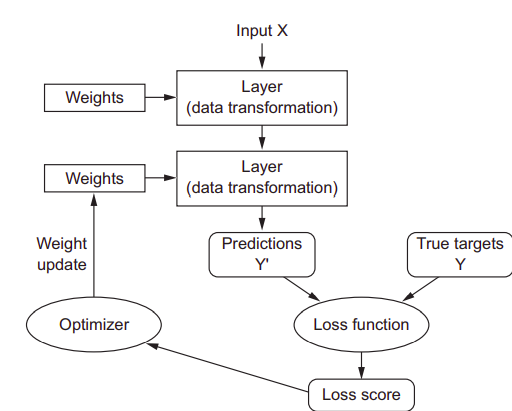

To do machine learning, we need three things:
1. Input data points—For instance, if the task is speech recognition, these data
points could be sound files of people speaking. If the task is image tagging,
they could be pictures.
2. Examples of the expected output—In a speech-recognition task, these could be
human-generated transcripts of sound files. In an image task, expected outputs
could be tags such as “dog,” “cat,” and so on.
3. A way to measure whether the algorithm is doing a good job—This is necessary in
order to determine the distance between the algorithm’s current output and
its expected output. The measurement is used as a feedback signal to adjust
the way the algorithm works. This adjustment step is what we call learning.

Data (useful)Representation:
meaningfully transform data

**What's a representation?**

It's a different way to look at data. To represent or encode data.

ll machine-learning algorithms consist of automatically finding such transformations that turn data into more-useful representations for a given task

Machine-learning models are all about finding appropriate representations for their input data—transformations of the data that make it more amenable to the task at hand, such as a classification task.

**Hypothesis space**

Machine-learning algorithms aren’t usually creative in finding these transformations; they’re merely searching through a predefined set of
operations, called a hypothesis space.

**Machine Learning**

Machine learning is, technically: searching for useful representations of some input data, within a predefined space of possibilities, using guidance
from a feedback signal. 

**Deep Learning** 

An emphasis on learning successive layers of increasingly
meaningful representations.
It stands for this idea of successive layers of representations. How many layers contribute to a model of the data is
called the **depth** of the model.
In deep learning, these layered representations are (almost always) learned via
models called **neural networks**.

**Shallow learning** 

Machine learning tend to focus on learning only one or two layers of representations of the data; hence, they’re sometimes called shallow learning

## **Understanding how deep learning works**

**NOTE** Don’t confuse regression and the algorithm logistic regression. Confusingly, logistic regression isn’t a regression algorithm—it’s a classification
algorithm.